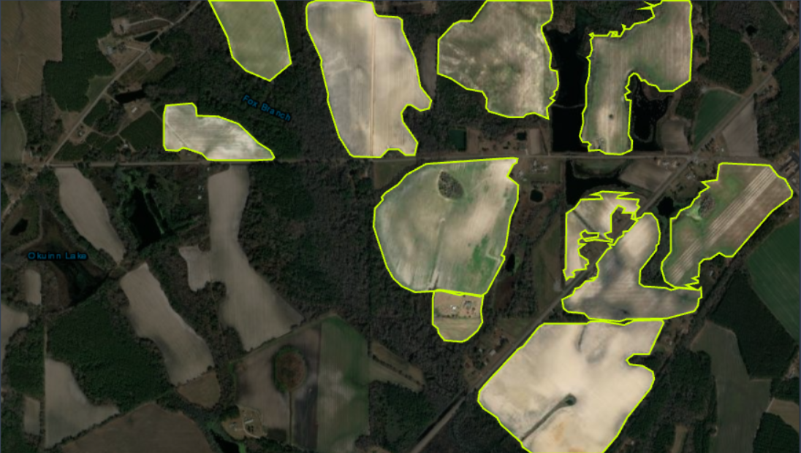
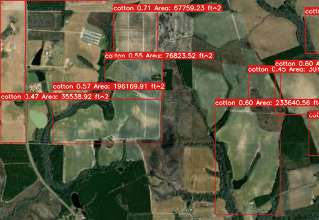
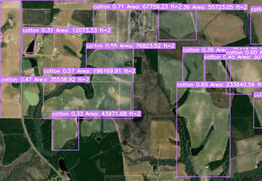
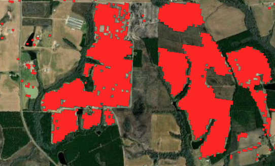

# lamassu-satellite

Check out [THIS](https://github.com/Archan6el/lamassu-website) git repo to see the web interface that utilizes our ML model

Our group first used [RoboFlow](https://roboflow.com/) to label the cotton fields within satellite aerial photos. Obtaining said satellite images and how we determined which fields were cotton fields was through the [USDA CroplandCROS site](https://croplandcros.scinet.usda.gov/). Soem output images from our data labeling can be found within `train/images` and `train/labels`. 

An example labeled image from our dataset

We then trained a YOLOv7 model with PyTorch, fine-tuning it to accurately recognize cotton fields in satellite images using our made dataset. After initial training, the model was evaluated and further adjusted to enhance its precision in detecting cotton fields based on labeled data. This refined model now serves as the core of our system, capable of analyzing new satellite images for cotton field detection.

Finally, we developed a straightforward Flask website as the front-end interface. This allows users to select an image file for analysis and set a confidence threshold for the model’s detections, providing an accessible way to engage with our model’s capabilities. The model outputs an image with identified cotton fields labeled, along with the model’s percent confidence and estimated area of said field. Example outputs are shown below.

 
Detection output with a 45% confidence threshold

Detection output with a 30% confidence threshold

True cotton field locations, marked in red, from the CroplandCROS web app
